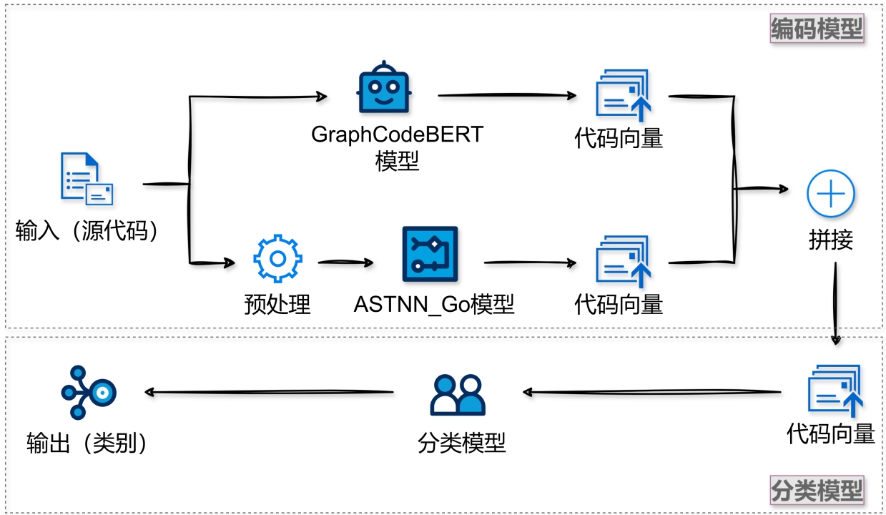

# LLM-Based Code Clustering Method

**Qiuhan Gu**

> This is my BS dissertation. 😊



*******

## Introduction

This design primarily focuses on deep learning and abstract syntax trees, targeting the Go language, and investigates how to efficiently model code in terms of lexical, syntactic, and semantic aspects while avoiding the problems of gradient vanishing and exploding. We collected a Go language dataset suitable for this design and performed a series of preprocessing steps to optimize the model input and enhance training efficiency. This design consists of two models: an encoding model and a classification model. In the encoding model, we use two sub-models, which are the GraphCodeBERT model and the modified ASTNN_Go model to obtain vector representations of code at the lexical, syntactic, and semantic levels. In the classification model, we defined custom classification categories, categorizing the code into regular and irregular code based on our definitions. The output of the encoding model is applied to the task of code classification, evaluating the quality of the code representation through classification accuracy.

The experimental results show that the classification model implemented in this design achieved an accuracy of 96.4%, demonstrating superior performance compared to other models.


## How to train

* `python pipeline.py`
* `python train.py`


## How to use

#### 1. use the script directly

* `cd usage`
* `vim script.py`, delete the final comment, modify `input_string` to your code snippet, save and exit.
* `python script.py`

#### 2. add it to your code

* Copy the entire `/usage` folder to your code directory.

* ```python
  from usage import script
  
  input_string="package domain\n\n\nfunc MathPaymentMethodFlag(methods []int) int {\n\tf := 0\n\tfor _, v := range methods {\n\t\tf |= 1 << uint(v-1)\n\t}\n\treturn f\n}\n\n\n\n\nfunc AndPayMethod(payFlag int, method int) bool \n\tf := 1 << uint(method-1)\n\treturn payFlag&f == f\n"
  
  label, probability = script.Cluster().cluster(input_string)
  
  print("The category of the program is（1 for Normal Data, 2 for Anomalous Data）："+ str(label))
  print("Specific probability of 1:2: "+str(probability))
  ```

#### 3. use the model directly

* Enter the `/cluster_go` folder, all the model-related files are saved here. I will upload it to the hugging face later.😊
